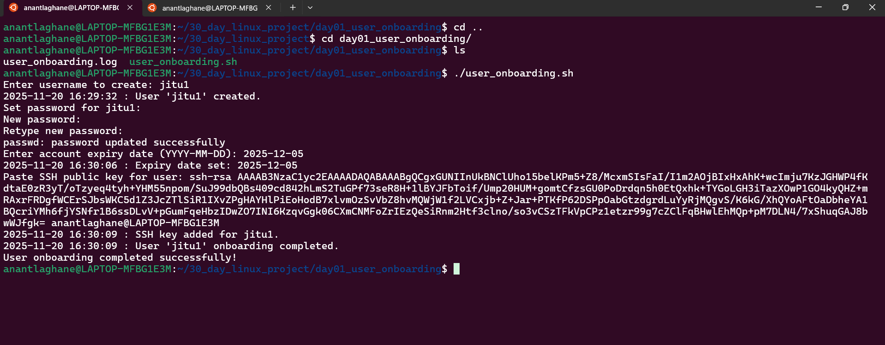

# 🧑‍💻 Day 1 — User Onboarding Automation (Linux Project)

This script automates the complete onboarding process for a new Linux user.

---

## 🚀 Features Implemented

✔ Create a new Linux user  
✔ Set password interactively  
✔ Configure account expiry  
✔ Add SSH Public Key for passwordless authentication  
✔ Generate audit logs  
✔ Error handling included

---

## 📂 Project Structure

```
day01_user_onboarding/
│── user_onboarding.sh
│── user_onboarding.log
│── README.md
```

---

## 🛠️ How It Works

### 1️⃣ Run Script
```bash
sudo ./user_onboarding.sh
```

### 2️⃣ Script Prompts:
- Enter username  
- Set password  
- Enter expiry date  
- Paste SSH public key  

---

## 📄 Log File Example
```
2025-11-20 16:29:32 : User 'jitu1' created.
2025-11-20 16:30:06 : Expiry date set: 2025-12-05
2025-11-20 16:30:09 : SSH key added for jitu1.
```

---

## 🎯 Purpose
This automation is helpful for DevOps engineers to streamline onboarding in Linux servers.

---

## ✨ Author  
**Anant laghane 

---
---



