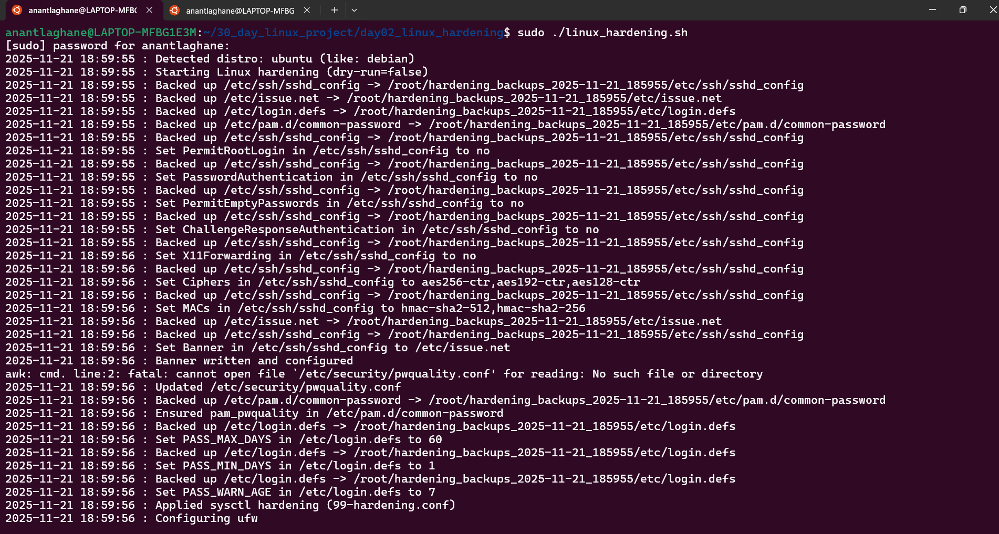
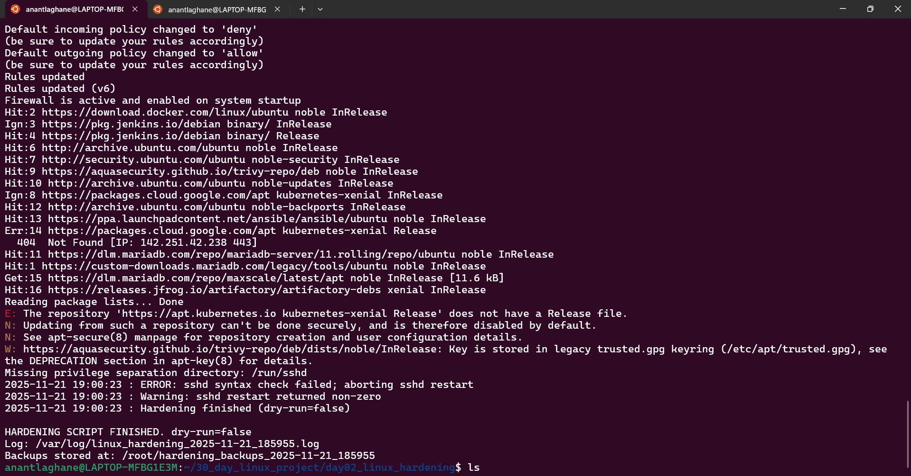

# 🛡️ Day 2 — Linux Hardening Automation (Security Project)

This script automates essential Linux security hardening tasks to protect the system from unauthorized access and enforce strong security policies.
---
## 🚀 Features Implemented

✔ Disable root SSH login
✔ Disable password-based SSH authentication
✔ Enforce key-based authentication
✔ Create a secure sudo user
✔ Apply strong password policies (PAM)
✔ SSH timeout configuration
✔ Enable UFW firewall
✔ Disable unused services
✔ Automatic backup of config files
✔ Undo (rollback) support
✔ Generate logs for every change
---
## 📂 Project Structure
day02_linux_hardening/
│── linux_hardening.sh
│── hardening_undo.sh
│── backup/
│── README.md
---
## 🛠️ How It Works
1️⃣ Run Hardening Script
sudo ./linux_hardening.sh

Script Performs:

Creates backup folder

Disables root login

Disables password login → enables SSH key authentication

Configures SSH timeout

Sets password complexity

Sets up UFW firewall

Creates secure sudo user

Logs all actions
---
## 2️⃣ Run Undo Script (Rollback)

If you want to revert all security changes:

sudo ./hardening_undo.sh
---

The undo script restores:

Default SSH configuration

Root login access

Password authentication

Original firewall state

Default password policy

Removes optional secure user
---
## 📄 Log File Example
2025-11-21 14:52:10 : Backup created at /backup/hardening-2025-11-21
2025-11-21 14:52:12 : Root SSH login disabled.
2025-11-21 14:52:13 : Password authentication disabled.
2025-11-21 14:52:14 : SSH idle timeout enabled.
2025-11-21 14:52:15 : Secure user 'secureadmin' created.
2025-11-21 14:52:17 : UFW firewall enabled.
---
## 🎯 Purpose

This automation helps DevOps engineers quickly apply industry-standard Linux hardening, improve server security, prevent brute-force attacks, enforce password rules, and maintain system compliance.

---
---

---
