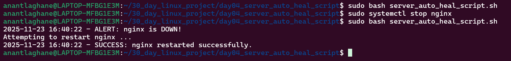

# 🗓️ Day 04 – Server Auto-Heal Script  

## 🚀 Project Goal  
Aaj ke task ka main objective tha:  
🔧 Create an **Auto-Heal Script** jo kisi server/service ko continuously monitor kare…  
Agar service down ho jaye → script automatically **restart** kare + **log** maintain kare.

Ye Linux sysadmin aur DevOps role dono ke liye ek real-world automation task hai.

---

## 📌 Features of Script  
✔ Checks if a service is running  
✔ If service is DOWN → auto-restart  
✔ Logs everything in `/var/log/auto_heal.log`  
✔ Supports Email alert (optional)  
✔ Works with any service like Apache, Nginx, MySQL, Docker, etc.

---
---
---

# ASCII Architecture Diagram

          ┌─────────────────────────┐
          │   Service Auto-Heal     │
          │       Script            │
          └──────────┬──────────────┘
                     │
      ┌──────────────┴────────────────┐
      │ Checks service status (loop)  │
      └──────────────┬────────────────┘
                     │
     ┌───────────────┴───────────────┐
     │  Is service DOWN / FAILED ?   │
     └───────┬──────────────┬────────┘
             │ Yes          │ No
             ▼              ▼
   ┌─────────────────┐   Continue  
   │ Restart service │   Monitoring
   └─────────────────┘
             │
             ▼
   ┌───────────────────────┐
   │ Log alert to logfile  │
   └───────────────────────┘

   

   ---

   

