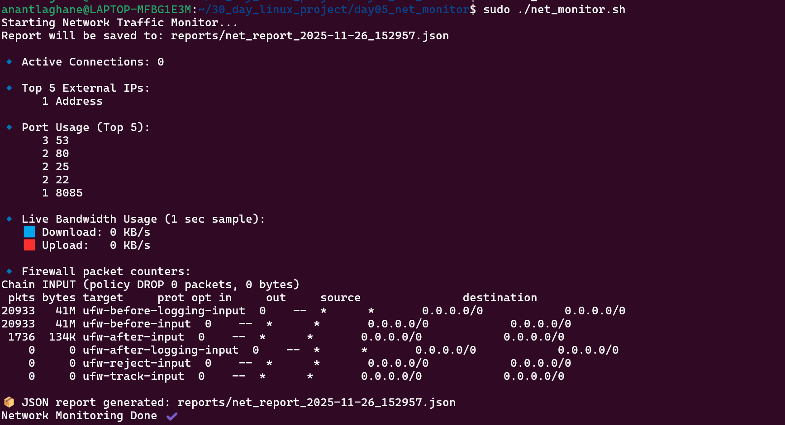

# 🛠 Day 05 — Advanced Log Analyzer 

This project is part of my **30-Day Linux Shell Scripting Challenge**.  
The script analyses web server logs and detects key security patterns.

---

## 📌 Features
- Count total log lines
- Top attacking IPs (Brute Force Indicators)
- Top requested URLs
- HTTP Status Code Summary
- DDoS-like traffic pattern detection
- JSON report generation

---

## 🧠 Technologies & Commands Used
| Tool / Command | Purpose |
|----------------|---------|
| `awk`, `grep`, `cut`, `sort`, `uniq` | Log parsing |
| `date` | Report naming |
| Regular Expressions | Pattern matching |
| Bash | Automation |

---
 

## 🚀 Usage
```bash
sudo ./log_analyzer.sh /var/log/nginx/access.log

