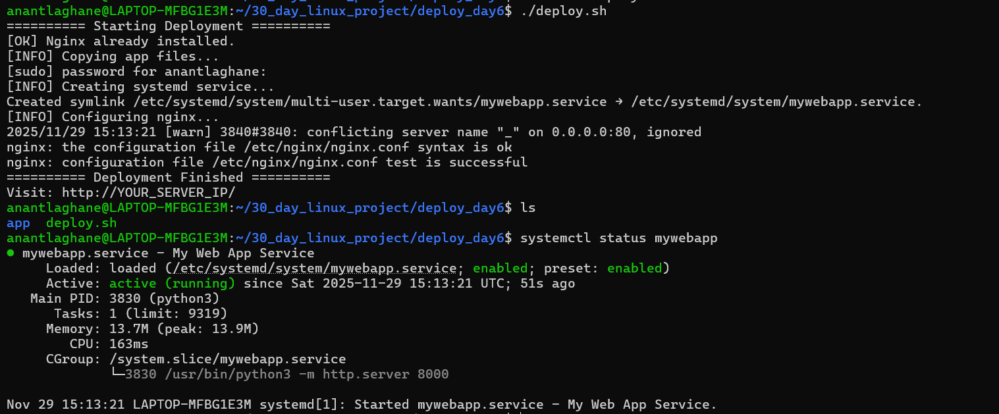

# 🚀 Day 6 — Web App Deployment Automation (Nginx + Systemd)

This project automates the deployment of a web application using:

- **Nginx** (Reverse Proxy)
- **Systemd Service** (App auto-start)
- **Python HTTP Server** (For demo)
- **Bash Automation Script** (`deploy.sh`)

---

## 📂 Project Structure

deploy_day8/
├── app/
│ └── index.html
└── deploy.sh

---

## 🛠 Features Automated

✔ Installs Nginx (if missing)  
✔ Copies app files to `/var/www/mywebapp`  
✔ Creates a custom `systemd` service  
✔ Starts service + enables auto-restart on boot  
✔ Configures Nginx reverse proxy  
✔ Restarts Nginx safely  
✔ One-click deployment  

---

## 🧠 How the Automation Works

### 1️⃣ Prepare app files
Place your web files inside `app/`.

### 2️⃣ Run deployment script
chmod +x deploy.sh
./deploy.sh

### 3️⃣ Access the application
Visit:
http://<your-server-ip>

---

## 🔧 Service File Generated

/etc/systemd/system/mywebapp.service

Runs:
ExecStart=/usr/bin/python3 -m http.server 8000

---

## 🌐 Nginx Reverse Proxy Created At

/etc/nginx/sites-available/mywebapp

---

## 📌 Useful Commands

Check service status:
systemctl status mywebapp

Check logs:
journalctl -u mywebapp -n 50 --no-pager

Restart Nginx:
systemctl restart nginx

---

## 🎯 Conclusion

You have created a **production-style automated web deployment system** using:

- Bash  
- Nginx  
- Systemd  
- Static Web App  

This is exactly how real companies automate internal apps.

---

# ⭐ Next Tasks (Recommended)
- Add rollback support  
- Add SSL automation (certbot)  
- Add Git-based deployment  
- Convert to Node/Flask/Django version

 
